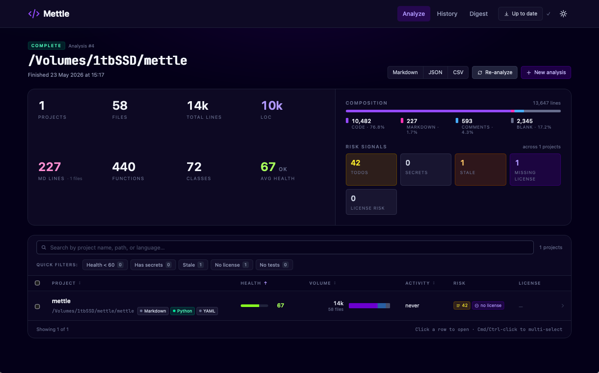
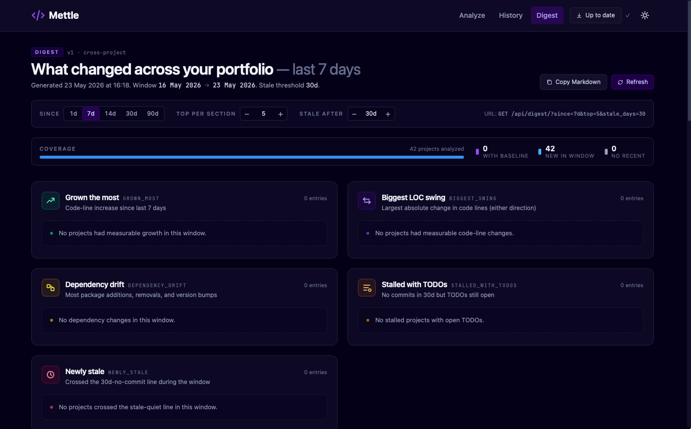

# Mettle

<div align="center">

[](https://github.com/mudislandkid/mettle/releases/latest)
[](LICENSE)
[](https://github.com/mudislandkid/mettle/actions/workflows/ci.yml)
[](pyproject.toml)

**A triage dashboard for the AI-coding era.**
Honest line counts, secret + license scanning, health scoring, and a cross-project digest that tells you what actually moved across your whole portfolio.

[**Download for macOS**](https://github.com/mudislandkid/mettle/releases/latest/download/Mettle-aarch64-apple-darwin.dmg) · [Releases](https://github.com/mudislandkid/mettle/releases) · [Issues](https://github.com/mudislandkid/mettle/issues)

</div>

---

<div align="center">



</div>

---

## Why Mettle?

If you ship code with AI assistants, your repos grow faster than your mental model of them. Mettle is the triage dashboard for that world.

Point it at a directory full of projects and it gives you:

- **An honest line count.** Blank / comment / code lines that always sum to total — no `if (x) {}` counted as a function, no `//` matched inside strings.
- **A cross-project digest** — one report covering your whole portfolio. Which projects grew most, biggest health swings, dependency drift, stale-but-with-open-TODOs, no-recent-activity.
- **Secret + license scanning.** Per-file context, severity, SPDX detection on `LICENSE` files, flags projects missing a license.
- **A health score per project.** 0-100 composite from comment ratio, test ratio, commit recency, TODO density — with per-component breakdown.
- **A native macOS app** with three hero pages: Digest, Analyze, History. Plus a self-hosted web option if you'd rather run it that way.

Self-hosted, no telemetry, single-binary backend.

---

## Quickstart

### Desktop (recommended)

1. [Download the .dmg](https://github.com/mudislandkid/mettle/releases/latest/download/Mettle-aarch64-apple-darwin.dmg) (~36 MB, Apple Silicon, signed + notarized)
2. Open it, drag **Mettle** to **Applications**
3. Launch. First open takes ~5-7s while the bundled backend boots
4. Click **Analyze**, pick a repo or parent folder, hit go

Auto-updates on each launch via the in-app updater.

### Self-hosted web

```bash
git clone https://github.com/mudislandkid/mettle.git
cd mettle
python3.12 -m venv .venv && source .venv/bin/activate
pip install -e ".[web]"
mettle web                           # dev mode: API on :8000, Vite on :5173
```

Open <http://localhost:5173>. For one-shot CLI runs instead:

```bash
mettle scan /path/to/your/project              # full single-project analysis
mettle batch /path/to/your/projects/           # cross-project batch
mettle digest --since 7d --top 5 --format md   # what changed in the last week
mettle check . --fail-on file-lines-over=500   # CI/pre-commit mode
```

Run any subcommand with `--help` for flags.

> **pyenv gotcha**: if `mettle web` fails with `ModuleNotFoundError`, your shell may be resolving an old shim. Run `hash -r` or call `python -m mettle web` instead.

---

## Features

- **~28 languages, deep structural analysis for the top 6.** Python (AST-level, McCabe complexity per function), JS/TS, HTML, CSS, C-style, shell. Anything else gets accurate line + language attribution. Drop a new analyzer into `mettle/analyzers/` and it auto-registers.
- **Honest metrics.** Blank / comment / code lines that always sum to total. No `if (x) {}` counted as a function. No `//` matched inside strings.
- **Cross-project digest.** Seven ranked sections: grown most, biggest health swings, dependency drift, stalled-with-TODOs, newly stale, new in window, no recent activity. Markdown / JSON / live web UI.

<div align="center">



</div>

- **Secret + SPDX license scanning.** Per-file context, severity. SPDX detection on `LICENSE` / `COPYING` files. Flags projects missing a license.
- **Three hero web pages.** Analyze (Empty → Running → Results state machine), History (heatmap + portfolio highlights), Digest (cross-project view above).
- **Batch CLI** for analysing folders-of-projects with `--github-user`, `--skip-public-sdks`, file-count caps, depth-limited discovery.
- **CI / pre-commit mode.** `mettle check . --fail-on file-lines-over=500` — non-interactive, exits non-zero on threshold violations.

See [docs/REFERENCE.md](docs/REFERENCE.md) for the full per-language, per-metric, and per-page breakdown.

---

## Architecture

```text
┌─────────────────┐    spawns      ┌────────────────────┐
│  Tauri shell    │ ─────────────> │  PyInstaller       │
│  (Rust, ~6 MB)  │ <─ port+token  │  FastAPI sidecar   │
│  + WebView      │ <── HTTP ────> │  + SQLite (WAL)    │
└─────────────────┘                └────────────────────┘
        │
        └── loads bundled Vue 3 dist (Vite, TypeScript, Tailwind)
```

- **Tauri shell** spawns the PyInstaller-frozen FastAPI sidecar on a random localhost port, learns the port + token via a stdout handshake.
- **Vue frontend** (bundled into the .app) calls the sidecar over HTTP; progress streams over WebSocket with auto-reconnect and exponential backoff.
- **In-app updater** verifies Ed25519 signatures against an embedded public key, downloads from GitHub Releases, swaps the bundle, relaunches.
- **CI** signs every executable with Apple Developer ID and submits to Apple's notary service before tagging the release.

Full architecture (DB schema, API endpoints, security model, signing pipeline): see [docs/DESKTOP.md](docs/DESKTOP.md) and [docs/REFERENCE.md](docs/REFERENCE.md).

---

## Contributing

PRs welcome. Project layout, dev setup, test commands, and commit conventions live in [CONTRIBUTING.md](CONTRIBUTING.md).

Code of Conduct: [CODE_OF_CONDUCT.md](CODE_OF_CONDUCT.md).

## Security

Don't open a public issue for vulnerabilities — see [SECURITY.md](SECURITY.md) for the private disclosure channel.

## License

[Apache-2.0](LICENSE).

## Acknowledgments

Built on FastAPI, SQLModel, Vue, Vite, Tauri, ECharts, ruff, and the wider open-source ecosystem. Inspired by every developer who has ever stared at a folder of half-finished side projects and wondered which one to pick back up.
